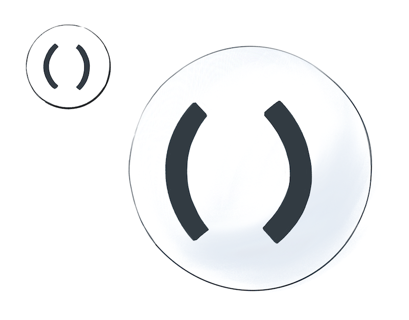

Without further ado, let’s resume our tour of the JavaScript universe!


In the previous module, we’ve looked at Undefined, Null, Booleans, and Numbers. We will now continue counting values — starting with BigInts.

# BigInts


BigInts were only recently added to JavaScript, so you won’t see them used widely yet. If you use an older browser, they won’t work. Regular numbers can’t represent large integers with precision, so BigInts [fill that gap](https://v8.dev/features/bigint?ck_subscriber_id=810733667) (literally):

```js
let alot = 9007199254740991n; // Notice n at the end
console.log(alot + 1n); // 9007199254740992n
console.log(alot + 2n); // 9007199254740993n
console.log(alot + 3n); // 9007199254740994n
console.log(alot + 4n); // 9007199254740995n
console.log(alot + 5n); // 9007199254740996n
```

No funny business with the rounding! This is great for financial calculations where precision is especially important. Keep in mind that nothing is free. Operations with _truly_ huge numbers may take time and resources.

How many BigInts are there in our universe? The specification says they have an _arbitrary precision._ This means that __in our JavaScript universe, there is an infinite number of BigInts — one for each integer in math.__

Yeah...

If this sounds strange, consider that you’re already comfortable with the idea of there being infinite integers in math. (If you’re not, give it a few moments!) It’s not much of a leap then from a “math universe” to a “JavaScript universe”.

_(And from there, we can go straight to the [Pepsi Universe](https://www.goldennumber.net/wp-content/uploads/pepsi-arnell-021109.pdf?ck_subscriber_id=810733667).)_

Of course, in practice, we can’t fit all the possible BigInts inside the computer memory. If we tried, at some point it would crash or freeze. But conceptually, Count von Count could be busy counting BigInts for eternity and never stop.

# Strings


Strings represent text in JavaScript. There are three ways to write strings (single quotes, double quotes, and backticks), but the result is the same:

```js
console.log(typeof("こんにちは")); // "string"
console.log(typeof('こんにちは')); // "string"
console.log(typeof(`こんにちは`)); // "string"
```

An empty string is a string, too:

```js
console.log(typeof('')); // "string"
```

## Strings Aren’t Objects

All strings have a few built-in properties.

```js
let cat = 'Cheshire';
console.log(cat.length); // 8
console.log(cat[0]); // "C"
console.log(cat[1]); // "h"
```

This doesn’t mean that strings are objects! String properties are special and don’t behave the way object properties do. For example, you can’t assign anything to cat[0]. Strings are primitives, and all primitives are immutable.

## A Value for Every Conceivable String

__In our universe, there is a distinct value for every conceivable string.__ Yes, this includes your grandmother’s maiden name, the fanfic you published ten years ago under an alias, and the script of Matrix 5 which hasn’t been written yet.

Of course, all possible strings can’t literally fit inside a computer memory chip. But the _idea_ of every possible string can fit inside your head. Our JavaScript universe is a model for humans, not for computers!
This might prompt a question. Does this code create a string?

```js
// Try it in your console
let answer = prompt('Enter your name');
console.log(answer); // ?
```

Or does it merely _summon_ a string that already exists in our universe?
The answer to this question depends on whether we’re studying JavaScript “from the outside” or “from the inside”.

_Outside_ our mental model, the answer depends on a specific implementation. Whether a string is represented as a single block of memory, multiple blocks, or [a rope](https://en.wikipedia.org/wiki/Rope_(data_structure)?ck_subscriber_id=810733667), is up to the JavaScript engine.

But _inside_ our mental model, this question doesn’t mean anything. We can’t set up an experiment to say whether strings “get created” or “get summoned” within our JavaScript universe.

To keep our mental model simple, we will say that __all conceivable string values already exist from the beginning — one value for every distinct string.__

# Symbols

Symbols are a relatively recent addition to the language.

```js
let alohomora = Symbol();
console.log(typeof(alohomora)); // "symbol"
```

It’s hard to explain their purpose and behavior without diving deeper into objects and properties, so for now we’re going to skip them. Sorry, symbols!


# Objects


At last, we got to objects!

This includes arrays, dates, RegExps, and other non-primitive values:

```js
console.log(typeof({})); // "object"
console.log(typeof([])); // "object"
console.log(typeof(new Date())); // "object"
console.log(typeof(/\d+/)); // "object"
console.log(typeof(Math)); // "object"
```

Unlike everything before, objects are not primitive values. This also means that by default, they’re mutable. We can access their properties with . or []:

```js
let rapper = { name: 'Malicious' };
rapper.name = 'Malice'; // Dot notation
rapper['name'] = 'No Malice'; // Bracket notation
```
We haven’t talked about properties in detail yet, so your mental model about them might be fuzzy. We will return to properties in a future module.

# Making Our Own Objects
There is one thing in particular that makes Count von Count excited about objects. __We can make more of them! We can make our own objects.__

In our mental model, all of the primitive values we’ve discussed — null, undefined, booleans, numbers, and strings — have “always existed”. We can’t “make” a new string or a new number, we can only “summon” that value:

```js
let sisters = 3;
let musketeers = 3;
```


What makes objects different is that we can create more of them. __Every time we use the {} object literal, we create a brand new object value:__

```js
let shrek = {};
let donkey = {};
```


The same goes for arrays, dates, and any other objects. For example, the [] array literal _creates_ a new array value — a value that never existed before.

# Do Objects Disappear?

You might wonder: do objects ever disappear, or do they hang around forever? JavaScript is designed in a way that we can’t tell one way or the other from inside our code. For example, we can’t _destroy_ an object:

```js
let junk = {};
junk = null; // Doesn't necessarily destroy an object
```

Instead, JavaScript is a garbage-collected language.

This means that although we can’t destroy an object, it _might_ eventually “disappear” if there is no way to reach it by following the wires from our code.


JavaScript doesn’t offer guarantees about _when_ garbage collection happens.

Unless you’re trying to figure out why an app is using too much memory, you don’t need to think about garbage collection too often. I only mention it here so that you know that we can create objects — but we cannot destroy them.

_In my universe, objects and functions float closest to my code. This reminds me that I can manipulate them and even make more of them._

# Functions



It is particularly strange to think about functions as values that are separate from my code. After all, they are my code. Or are they not?

## Functions Are Values

We define functions so that we can call them later and run the code inside them. However, to really understand functions in JavaScript, we need to forget about _why_ they’re useful for a second. Instead, we will think about functions as yet another kind of value: a number, an object, a _function_.

To understand functions, we will compare them to numbers and objects.
First, consider this for loop that runs console.log(2) seven times:

```js
for (let i = 0; i < 7; i++) {
  console.log(2);
}
```

__How many different values does it pass to console.log?__ To answer this, let’s recall what 2 means when we write it down. It is a number literal. A literal is an expression — a question to our universe. There is only one value for every number in our universe, so it “answers” our question by “summoning” the same value for the number 2 every time. __So the answer is one value.__ We will see the log seven times — but we are passing the same value in each call.

Now let’s briefly revisit objects.

Here is another for loop that runs console.log({}) seven times:

```js
for (let i = 0; i < 7; i++) {
  console.log({});
}
```

__How many different values does it pass to console.log now?__ Here, too, {} is a literal — except it’s an object literal. As we just learned, the JavaScript universe doesn’t “answer” an object literal by summoning anything. Instead, it creates a new object value — which will be the result of the {} object literal. __So the code above creates and logs seven completely distinct object values.__

Let that sink in.

Now let’s have a look at functions.

```js
for (let i = 0; i < 7; i++) {
  console.log(function() {});
}
```

__How many different values does this code pass to console.log?__

__SPOILERS BELOW__

Don’t scroll further until you have decided on an answer.

...

...

...

...

...

...

...

...

...

...

The answer is seven.

__Every time we execute a line of code that contains a function expression, a brand new function value appears in our universe.__


Here, too, function() {} is an expression. Like any expression, a function expression is a “question” to our JavaScript universe — __which answers us by _creating_ a new function value every time we ask__. This is very similar to how {} creates a new object value when it executes. Functions are like objects!

Technically, functions are objects in JavaScript. We’ll keep treating them as a separate fundamental type because they have unique capabilities compared to regular objects. But, generally speaking, if you can do something to an object, you can also do that to a function too. They are very special objects.

# Calling a Function

What does this code print?

```js
let countDwarves = function() { return 7; };
let dwarves = countDwarves;
console.log(dwarves);
```

You might think that it prints 7, especially if you’re not looking very closely.

Now check this snippet in the console! The exact thing it prints depends on the browser, but you will see _the function itself_ instead of the number 7 there.

If you follow our mental model, this behavior should make sense:

1. First, we created a new function value with a `function()` { } expression, and pointed the countDwarves variable at this value.
2. Next, we pointed the dwarves variable at the value that `countDwarves` is pointing to — which is the same function value.
3. Finally, we logged the value that dwarves is currently pointing to.

_At no point, did we call our function!_

As a result, both countDwarves and dwarves point at the same value, which happens to be a function. See, functions are values. We can point variables to them, just like we can do with numbers or objects.

__Of course, if we want to call a function, we can do that too:__

```js
let countDwarves = function() { return 7; };
let dwarves = countDwarves(); // () is a function call
console.log(dwarves);
```

Note that neither the let declaration nor the = assignment have anything to do with our function call. It’s () that performs the function call — and it alone!

__Adding () changes the meaning of our code:__

- `let dwarves` = countDwarves means “Point `dwarves` towards the value that `countDwarves` is pointing to.”
- `let dwarves` = `countDwarves()` means “Point `dwarves` towards the value __returned by__ the function that `countDwarves` is pointing to.”

In fact, `countDwarves()` is also an expression. It’s called _a call expression._ To “answer” a call expression, JavaScript runs the code inside our function, and hands us the returned value as the result (in this example, it’s 7).

We’ll look at function calls in more detail in the future modules.

# Recap

That was quite a journey! Over the last two modules, we have looked at every value type in JavaScript. Let’s join Count von Count in recapping how many values there are of each type, starting with the different primitive types:


- __Undefined__: Only one value, `undefined`.
- __Null__: Only one value, `null`.
- __Booleans__: Two values: `true` and `false`.
- __Numbers__: One value for each [floating point math number](https://en.wikipedia.org/wiki/Double-precision_floating-point_format?ck_subscriber_id=810733667).
- __BigInts__: One value for every conceivable integer.
- __Strings__: One value for every conceivable string.
- __Symbols__: We skipped Symbols for now, but we’ll get to them someday!

The types below are special because they let us make our own values:


- __Objects__: One value for every object literal we execute.
- __Function__: One value for every function expression we execute.

It was fun to visit the different “celestial spheres” of JavaScript. Now that we’ve counted all the values, we’ve also learned what makes them distinct from one another. __For example, writing 2 or "hello" always “summons” the same number or a string value. But writing {} or function() {} always creates a brand new, different value.__ This idea is crucial to understanding equality in JavaScript, which will be the topic of the next module.

# Exercises

This module also has exercises for you to practice!

[__Click here__ to solidify this mental model with a few short exercises.](https://eggheadio.typeform.com/to/STEeMy?email=dena.denacho@gmail.com&ck_subscriber_id=810733667)

__Don’t skip them!__

Even though you’re probably familiar with different types of values, these exercises will help you cement the mental model we’re building. We need this foundation before we can get to more complex topics.
Once you complete the exercises I will send the next module.

​